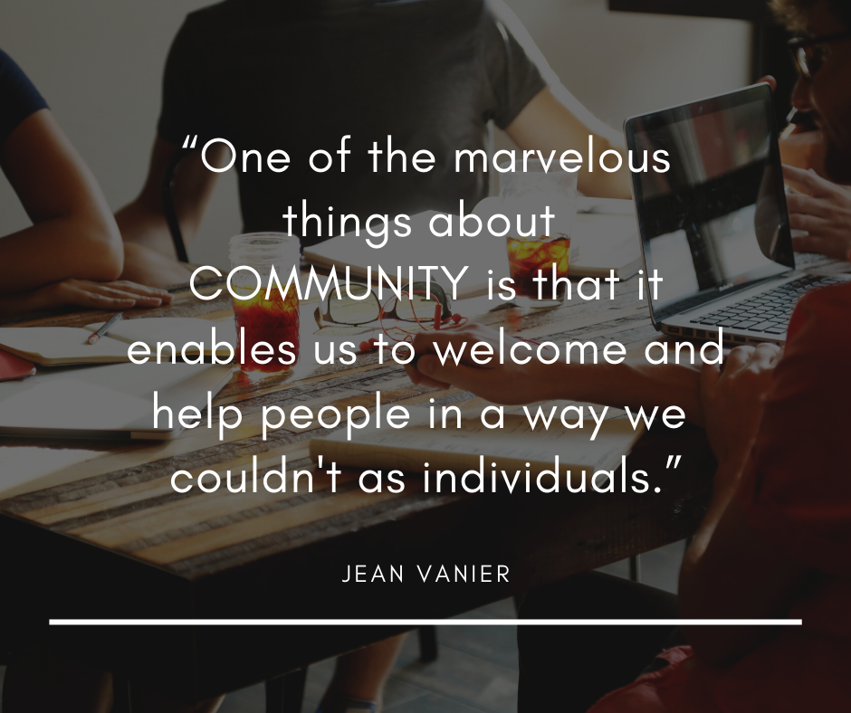
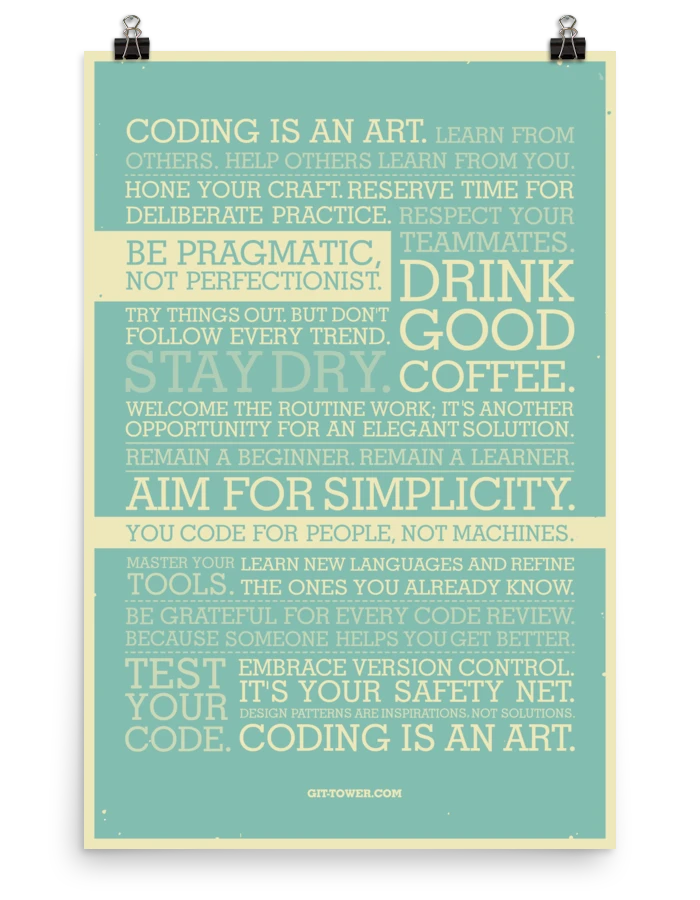

# 👋 Welcome

Hola Amigos 👋  
My name is Yash Sharma and I'm based in India. I'm a Tech, DevRel and Community enthusiast. I LOVE to meet new people, disccuss about tech stuff, products and communities.  
I'm having 3+ years of working experience in the domain of web development, blockchain, and tech communities. I taught and mentor 3000+ students through hackathons, meetups, conferences, and webinars. 2+ years of experience in professional community management. Delivered several talks and sessions on blockchain and other emerging technologies. I influence emerge tech and support communities to empower students and developers for establishing a better tech ecosystem.  

## Communities I Manage

* Zubi \(Z.Community\) - Community Manager
* Script Foundation India \(North India Region Head\)
* Developer Circles from Facebook - Jaipur \(Core Team Member\)
* JaipurJS \(Co-organizer\)

