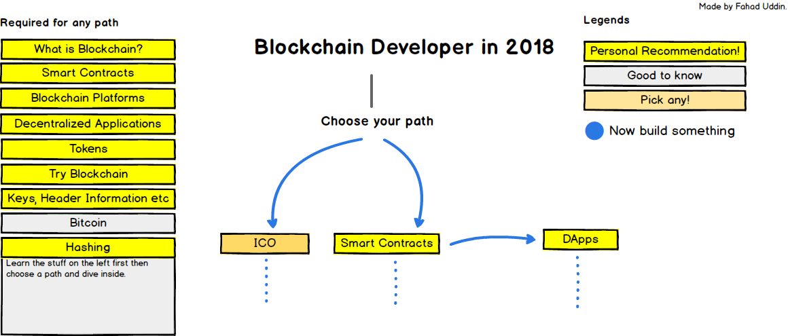

# Blockchain Resources

This is a visual roadmap for beginners venturing into the World of Software Development. In order not to feel overwhelmed by how much you need to know to be a Blockchain Developer. This roadmap serves as a guide through out your journey. You can follow through this guide and be assured you are on the right path.

Resource types:  
🎮 - Interactive  
📚 - Book  
📹 - Video  
📝 - Article  
🎤 - Podcast  
👩‍💻 - Community  
💰 - Paid Resource  
🎁- Free Resource  
🏆 - Exercises

## Articles

1. Read [Blockchain- \(Explain Like I’m 5\)](https://medium.com/%40vijay.betigiri/blockchain-explained-like-im-5-yrs-5f04b91b059c) or [Explain like I’m 5: Blockchain](https://www.linkedin.com/pulse/blockchain-5th-graders-hayley-somerville)
2. Read [bitcoinbook](https://github.com/bitcoinbook/bitcoinbook)
3. Read [What is Blockchain Technology? A Step-by-Step Guide For Beginners!](https://blockgeeks.com/guides/what-is-blockchain-technology/)
4. Read [Learn All About Cryptocurrencies Cryptography: How Does it All Work?](https://blockgeeks.com/guides/cryptocurrencies-cryptography/)
5. Read [What is Cryptocurrency?](https://blockgeeks.com/guides/what-is-cryptocurrency/)
6. Read [What is Bitcoin?](https://blockgeeks.com/guides/what-is-bitcoin/)
7. Read [Bitcoin White Paper](https://bitcoin.org/bitcoin.pdf)
8. Read [Different Consensus Protocols](https://blockgeeks.com/guides/blockchain-consensus/)
9. Read [More about different consensus mechanisms](https://hackernoon.com/consensuspedia-an-encyclopedia-of-29-consensus-algorithms-e9c4b4b7d08f)
10. Read [What is Ethereum?](https://blockgeeks.com/guides/ethereum/)
11. Read [How does Ethereum work?](https://medium.com/%40preethikasireddy/how-does-ethereum-work-anyway-22d1df506369)
12. Read the Book [Mastering Ethereum](https://github.com/ethereumbook/ethereumbook)
13. Read [Bitcoin VS Ethereum: \[The Ultimate Step-by-Step Comparison Guide\]](https://blockgeeks.com/guides/bitcoin-vs-ethereum-ultimate-comparison-guide/)
14. Complete [CryptoZombies: Building Your Own Game using Solidity](https://cryptozombies.io/)
15. [Space Doggos - Interactive Learning Solidity Course](https://www.bitdegree.org/course/learn-solidity-space-doggos)
16. Read [How to Code Your Own CryptoKitties-Style Game on Ethereum](https://medium.com/loom-network/how-to-code-your-own-cryptokitties-style-game-on-ethereum-7c8ac86a4eb3)
17. Read [The Official Solidity Documentation](https://solidity.readthedocs.io/en/v0.5.11/)
18. Go through [Azure Smart Contract Samples](https://github.com/Azure-Samples/blockchain/tree/master/blockchain-workbench/application-and-smart-contract-samples)
19. Play the Web3/Solidity based wargame: [Ethernaut](https://ethernaut.zeppelin.solutions/)
20. Read and make a simple dapp: [Pet shop tutorial](http://truffleframework.com/tutorials/pet-shop)
21. Read the [Ganache Documentation](https://www.trufflesuite.com/docs/ganache/quickstart)
22. Read the [Truffle Documentation](https://truffleframework.com/docs/)
23. Read the [Web3 Documentation](https://web3js.readthedocs.io/en/1.0/)
24. [Understanding IPFS in Depth](https://medium.com/hackernoon/understanding-ipfs-in-depth-1-5-a-beginner-to-advanced-guide-e937675a8c8a)
25. [Ethereum and Solidity: The Complete Developer’s Guide](https://www.udemy.com/ethereum-and-solidity-the-complete-developers-guide/)
26. [Blockchain: Foundations and Use Cases](https://www.coursera.org/learn/blockchain-foundations-and-use-cases/home/welcome)
27. [The Complete Node.js Developer Course](https://www.udemy.com/the-complete-nodejs-developer-course-2/)
28. [Learn to Code Ethereum DApps By Building Your Own Game](https://cryptozombies.io/)
29. Getting Deep Into Ethereum: [How Data Is Stored In Ethereum?](https://hackernoon.com/getting-deep-into-ethereum-how-data-is-stored-in-ethereum-e3f669d96033)
30. Checkout [Ethereum for DUMMIES](https://hackernoon.com/ethereum-for-dummies-af5aeacb13d4)
31. Develop a [Blockchain application from scratch in Python](https://developer.ibm.com/technologies/blockchain/tutorials/develop-a-blockchain-application-from-scratch-in-python/)
32. Lets create our [first Hello World Dapp](https://blog.zubi.io/lets-create-our-first-helloworld-dapp/)
33. [Bitcoin and Cryptocurrency Bootcamp](https://www.udemy.com/bitcoin-and-cryptocurrency-bootcamp/) on Udemy
34. [Blockchain A-Z™: Learn How To Build Your First Blockchain](https://www.udemy.com/build-your-blockchain-az/) on Udemy
35. [Ethereum and Solidity: The Complete Developer’s Guide](https://www.udemy.com/ethereum-and-solidity-the-complete-developers-guide/) on Udemy
36. [Blockchain Essentials](https://cognitiveclass.ai/courses/blockchain-course/) from Cognitive Class
37. [IBM Blockchain Foundation Developer](https://cognitiveclass.ai/courses/ibm-blockchain-foundation-dev/) from Cognitive Class
38. [Blockchain Specialization](https://www.coursera.org/specializations/blockchain) offered by University at Buffalo & The State University of New York on Coursera
39. [Bitcoin and Cryptocurrency Technologies](https://www.coursera.org/learn/cryptocurrency) offered by Princeton University on Coursera
40. [Blockchain: Foundations and Use Cases](https://www.coursera.org/learn/blockchain-foundations-and-use-cases) offered by Consensys Academy on Coursera
41. [FinTech Law and Policy](https://www.coursera.org/learn/fintechlawandpolicy) offered by Duke University on Coursera
42. Blockchain 101 - A Visual Demo: [YouTube](https://www.youtube.com/watch?v=_160oMzblY8)
43. Blockchain basics: [Lynda](https://www.lynda.com/Data-Science-tutorials/Blockchain-Basics/574704-2.html)
44. Basic Blockchain [Essentials course by IBM](https://cognitiveclass.ai/courses/blockchain-course/)
45. Ethereum whitepaper: [https://github.com/ethereum/wiki/wiki/White-Paper](https://github.com/ethereum/wiki/wiki/White-Paper)
46. [Ethereum course \(highly recommended - paid\): https://www.udemy.com/ethereum-and- solidity-the-complete-developers-guide/](https://www.udemy.com/ethereum-and-solidity-the-complete-developers-guide/)
47. A good resource to learn dApp development by coding your own game: [https://cryptozombies.io/](https://cryptozombies.io/)
48. A good grasp on concepts of Decentralised Applications: [https://www.theschool.ai/courses/decentralized-application/](https://www.theschool.ai/courses/decentralized-application/)
49. [Excellent course on Coursera: https://www.coursera.org/learn/blockchain-foundations- and-use-cases](https://www.coursera.org/learn/blockchain-foundations-and-use-cases)
50. Course on Coursera : [https://www.coursera.org/learn/blockchain-basics](https://www.coursera.org/learn/blockchain-basics)
51. For getting started: [https://hyperledger-fabric.readthedocs.io](https://hyperledger-fabric.readthedocs.io/)
52. Fabric samples - Chaincode, SDKs and Network setup: [https://github.com/hyperledger/fabric-samples](https://github.com/hyperledger/fabric-samples)
53. Hyperledger tutorWhat is Blockchain Technology: https://[www.coindesk.com/information/what-is-blockchain-technology/](http://www.coindesk.com/information/what-is-blockchain-technology/)
54. [What is Bitcoin?](http://www.coindesk.com/information/what-is-bitcoin/) by CoinDesk
55. [What is Bitcoin?](http://money.cnn.com/infographic/technology/what-is-bitcoin/) by CNN Money
56. [The Impact of the Blockchain Goes Beyond Financial Services](https://hbr.org/2016/05/the-impact-of-the-blockchain-goes-beyond-financial-services) by Don an Alex Tapscott
57. \[Elliptic Curve Digital Signature Algorithm and its Applications in Bitcoin \([http://cs.ucsb.edu/~koc/ecc/project/2015Projects/Malvik+Witzoee.pdf](http://cs.ucsb.edu/~koc/ecc/project/2015Projects/Malvik%2BWitzoee.pdf)\) by Arnt Gunnar Malvik and Bendik Witzoee
58. [Programming Bitcoin Transaction Scripts](https://docs.google.com/document/d/1D_gi_7Sf9sOyAHG25cMpOO4xtLq3iJUtjRwcZXFLv1E/edit) by Kofler
59. [Developer’s Introduction to Bitcoin](http://bitcoinmagazine.com/9249/developers-introduction-bitcoin/) by Buterin
60. [How Bitcoin Works Under the Hood](http://www.imponderablethings.com/2013/07/how-bitcoin-works-under-hood.html) by Driscoll
61. [Bitcoins the hard way: Using the raw Bitcoin protocol](http://www.righto.com/2014/02/bitcoins-hard-way-using-raw-bitcoin.html) by Shirriff
62. [Bitcoin mining the hard way: the algorithms, protocols, and bytes](http://www.righto.com/2014/02/bitcoin-mining-hard-way-algorithms.html) by Shirriff
63. [Cryptographic Currencies Crash Course \(C4\)](http://www2016.net/proceedings/companion/p1021.pdf) by Aljosha Judmayer and Edgar Weipp
64. [The libbitcoin Tutorial](http://libbitcoin.dyne.org/doc/) by Taaki
65. [How to Parse the Bitcoin Blockchain](http://codesuppository.blogspot.com/2014/01/how-to-parse-bitcoin-blockchain.html) by Ratcliff
66. [Signing Offline Transactions](https://gist.github.com/jashmenn/9811205) by Maxwell
67. [2 of 2 escrow example](https://gist.github.com/jashmenn/9811198) by Maxwell
68. [2 of 3 multisig example](https://gist.github.com/jashmenn/9811185) by Andresen
69. [How to decrypt messages in the blockchain from btcmsg](https://gist.github.com/ripper234/1625828) by ripper234
70. [Ask Dr. Bitcoin: What are Side-Chains](http://siliconangle.com/blog/2014/04/21/bitcoin-sidechains/)
71. [Introduction To Sidechains and Blockchain 2.0](https://www.deepdotweb.com/2014/06/26/sidechains-blockchain-2-0/)
72. [Sidechains, Treechains, the TL;DR](http://blog.greenaddress.it/2014/06/13/sidechains-treechains-the-tldr/) by Sanders
73. [Side Chains: The How, The Challenges and the Potential](http://bitcoinmagazine.com/12349/side-chains-challenges-potential/) by Buterin
74. [Sidechain Technical Feasibility Discussion](https://bitcointalk.org/index.php?topic=566704.0%3Ball) \(discussion\)
75. [Alternative Chains / merged mining](https://en.bitcoin.it/wiki/Alternative_Chains)
76. The Initial Two-Way Pegging [proposal](http://sourceforge.net/p/bitcoin/mailman/message/32108143/) by Adam Back
77. Blockstream Whitepaper [Enabling Blockchain Innovations with Pegged Sidechains](https://www.blockstream.com/sidechains.pdf)
78. [Tree-chains preliminary summary](http://www.mail-archive.com/bitcoin-development%40lists.sourceforge.net/msg04388.html) by Todd
79. [Sidechains: Alpha Sidechain Tutorial](http://blog.cryptoiq.ca/?p=395)
80. [A Treatise on Altcoins](https://download.wpsoftware.net/bitcoin/alts.pdf)
81. [How To Clone Scrypt Based Altcoins for Fun and Profit](http://devtome.com/doku.php?id=scrypt_altcoin_cloning_guide&rev=1391981820) by shakezula
82. [What is hashing](https://blockgeeks.com/guides/what-is-hashing/)
83. [Blockchain Explained: How Immutability Works](https://www.verypossible.com/blog/blockchain-explained-how-does-immutability-work)
84. [A Gentle Introduction to Immutability of Blockchains](https://bitsonblocks.net/2016/02/29/a-gentle-introduction-to-immutability-of-blockchains/)
85. [A HitchHiker's Guide to Consensus Algorithms - Hacker Noon](https://hackernoon.com/a-hitchhikers-guide-to-consensus-algorithms-d81aae3eb0e3)
86. [Short Guide to Blockchain Consensus Protocols](https://www.coindesk.com/short-guide-blockchain-consensus-protocols/)
87. [Beginner's Guide to Ethereum Casper Hardfork: What You Need to Know](https://blockonomi.com/ethereum-casper/)
88. [How to Time-Stamp a Digital Document](https://www.anf.es/pdf/Haber_Stornetta.pdf)
89. [The Meaning of Decentralization](https://medium.com/%40VitalikButerin/the-meaning-of-decentralization-a0c92b76a274)
90. [Blockchains don’t scale. Not today, at least. But there’s hope.](https://hackernoon.com/blockchains-dont-scale-not-today-at-least-but-there-s-hope-2cb43946551a)
91. [How Safe Are Blockchains? It Depends](https://hbr.org/2017/03/how-safe-are-blockchains-it-depends)
92. [Blockchain Open Source Code is Failing on Security Says CAST](https://data-economy.com/blockchain-open-source-code-is-failing-on-security-says-cast/)
93. [Beyond the Bitcoin Bubble by Steven Johnson](https://www.nytimes.com/2018/01/16/magazine/beyond-the-bitcoin-bubble.html)
94. [IBM's Blockchain Market Reports](https://www-935.ibm.com/services/us/gbs/thoughtleadership/blockchainlibrary.html)
95. [A rant about blockchains](https://hackernoon.com/a-rant-about-blockchains-2235b96d64cf)
96. [A Fistful of Bitcoins: Characterizing Payments Among Men with No Names](http://cseweb.ucsd.edu/~smeiklejohn/files/imc13.pdf) - University of San Diego California
97. [A brave new world? What impact will distributed ledger technology have on the financial industry? - The European Central Bank](https://www.ecb.europa.eu/paym/pdf/infocus/20160422_infocus_dlt.pdf)
98. [An Architecture for the Internet of Money](https://docs.google.com/document/d/1Bc-kZXROTeMzG6AvH7rrTrUy24UwHoEcgiL7ALHMO0A/pub) - Meher Roy
99. [Banking in a world of programmable assets](https://www.accenture.com/t20160509T223022__w__/us-en/_acnmedia/PDF-16/Accenture-Strategy-Banking-World-of-Programmable-Assets.pdf) - Accenture
100. [Bitcoin Primer](http://www.macroriskadvisors.com/layout/pdf/bitcoin%20primer%20BTC.pdf) - Macro Risk Advisors
101. [Bitcoin as Money?](http://www.bostonfed.org/economic/current-policy-perspectives/2014/cpp1404.pdf) - Stephanie Lo and J. Christina Wang
102. [Bitcoin](http://research.microsoft.com/pubs/156072/bitcoin.pdf) - Microsoft Research
103. [BlockChain Technology Beyond Bitcoin](http://scet.berkeley.edu/wp-content/uploads/BlockchainPaper.pdf) - University of California,Berkeley
104. [Blockchain: practical implications of a revolutionary technology for financial markets and beyond - DLA Piper](https://www.dlapiper.com/en/uk/insights/events/2016/04/blockchain-practical-implications/11-apr-2016/)
105. [Blockchain: the solution for transparency in product supply chains](https://www.provenance.org/whitepaper) - Project Provenance Ltd
106. [Blockstack: A Global Naming and Storage System Secured by Blockchains](https://blockstack.org/blockstack.pdf) - Muneeb Ali, Jude Nelson, Ryan Shea and Michael J. Freedman
107. [Bootstrapping Trust in Distributed Systems with Blockchains](https://blockstack.org/blockstack-login.pdf) - Muneeb Ali, Jude Nelson, Ryan Shea and Michael J. Freedman
108. [Consensus – Immutable agreement for the internet of value](https://assets.kpmg.com/content/dam/kpmg/pdf/2016/06/kpmg-blockchain-consensus-mechanism.pdf) - KPMG
109. [Distributed Ledger Technology: beyond block chain](https://www.gov.uk/government/uploads/system/uploads/attachment_data/file/492972/gs-16-1-distributed-ledger-technology.pdf) - UK Government Chief Scientific Adviser
110. [Economics of Bitcoin](http://nakamotoinstitute.org/static/docs/economics-of-bitcoin.pdf) - Peter Surda
111. [Enabling Blockchain Innovations with Pegged Sidechains](https://blockstream.com/sidechains.pdf) - Adam Back, Matt Corallo, Luke Dashjr, Mark Friedenbach, Gregory Maxwell, Andrew Miller, Andrew Poelstra, Jorge Timón, and Pieter Wuille
112. [Extending Existing Blockchains with Virtualchain](https://blockstack.org/virtualchain.pdf) - Jude Nelson, Muneeb Ali, Ryan Shea and Michael J. Freedman
113. [The Impact and Potential of Blockchain on the Securities Transaction Lifecycle](http://www.zyen.com/Publications/The%20Impact%20and%20Potential%20of%20Blockchain%20on%20the%20Securities%20Transaction%20Lif....pdf) - The Swift Institute
114. [World Citizenship by Creating Affordable Private Passport Service](https://docs.google.com/document/d/1hq52GT0sQ8mJBZ3_qr-LIpZTBFqIDA2WV8vb_1m8i4U/edit) - Chris Ellis
115. [Cryptoeconomics for dummies](https://medium.com/%40j32804/cryptoeconomics-for-dummies-part-0-7172efa81507)
116. [Cryptoeconomics 101](https://thecontrol.co/cryptoeconomics-101-e5c883e9a8ff)
117. [Making Sense of Cryptoeconomics](https://medium.com/l4-media/making-sense-of-cryptoeconomics-c6455776669) Making Sense of Cryptoeconomics by Josh Stark
118. [What is Cryptoeconomics](https://blockgeeks.com/guides/what-is-cryptoeconomics/) What is Cryptoeconomics, a guide by BlockGeeks
119. [How Society Will Be Transformed By Cryptoeconomics](https://media.comakery.com/how-society-will-be-transformed-by-crypto-economics-b02b6765ca8c)
120. [Paving the Future of Blockchain Technology](https://hackernoon.com/cryptoeconomics-paving-the-future-of-blockchain-technology-13b04dab971)
121. [Vivek Singh's Cryptoeconomics in context](https://hackernoon.com/cryptoeconomics-in-context-6435ad6839be)
122. [Cryptoeconomics Definitions Part 1](https://cryptoeconomics.asia/2017/09/04/cryptoeconomics-definitions-p1/), [Part 2](https://cryptoeconomics.asia/2017/09/05/cryptoeconomics-definition/) and [Part 3](https://cryptoeconomics.asia/2017/09/25/cryptoeconomics-definitions-blockchain-economics/)
123. [The Blockchain Economy: A beginner’s guide to institutional cryptoeconomics](https://medium.com/%40cryptoeconomics/the-blockchain-economy-a-beginners-guide-to-institutional-cryptoeconomics-64bf2f2beec4) by RMIT Blockchain Innovation Hub
124. [Cryptoeconomics is Hard Part 1](https://blog.coinfund.io/cryptoeconomics-is-hard-ad401b2428b9), [Part 2](https://blog.coinfund.io/cryptoeconomics-is-hard-part-2-4d522cb3d3a4) and [Part 3](https://blog.coinfund.io/cryptoeconomics-is-hard-market-cap-4833c378a3e0) by Aleksandr Bulkin
125. [How to create a cryptoeconomic protocol from scratch](https://mattgoldenberg.net/2016/10/26/vlad-zamfir-how-to-create-a-crypto-economic-protocol-from-scratch/) by Vlad Zamfir
126. [Behavioural Crypto-Economics](https://medium.com/berlin-innovation-ventures/behavioral-crypto-economics-6d8befbf2175) the challenge and promise of Blockchain Incentive Design by Elad Verbin
127. [Introduction to Blockchain through Cryptoeconomics](https://blockchainatberkeley.blog/introduction-to-blockchain-through-cryptoeconomics-part-1-bitcoin-369f245067f9) by Zubin Koticha
128. [The need for an Incentive scheme in Algorand](https://blockchainatberkeley.blog/the-need-for-an-incentive-scheme-in-algorand-6fe9db45f2a7) by Alexis Guaba, Zubin Koticha
129. [Cryptoeconomics.study](https://cryptoeconomics.study/) -- An free and open source book & course on Cryptoeconomics
130. [Cryptographic Primitives](https://en.wikipedia.org/wiki/Cryptographic_primitive) as described in Wikipedia
131. [A Graduate Course in Applied Cryptography](https://toc.cryptobook.us/) by Dan Boneh and Victor Shoup
132. [Ethereum: Signing and Validating](https://medium.com/%40angellopozo/ethereum-signing-and-validating-13a2d7cb0ee3)
133. [Merkling in Ethereum](https://blog.ethereum.org/2015/11/15/merkling-in-ethereum/) by Vitalik Buterin
134. [Bitcoin's Academic Pedigree](https://queue.acm.org/detail.cfm?id=3136559) by Arvind Narayanan and Jeremy Clark
135. [PoW and Blockchains](https://www.zurich.ibm.com/dccl/papers/eyal_dccl_slides.pdf) presentation by Prof. Ittay Eyal \(IC3\)
136. [The PoW concept](https://nakamotoinstitute.org/mempool/the-proof-of-work-concept/) article by the Nakamoto Institute
137. [ConsensusPedia - An Encylopedia of 29 consensus algorithms](https://hackernoon.com/consensuspedia-an-encyclopedia-of-29-consensus-algorithms-e9c4b4b7d08f) article by the Nakamoto Institute\) article by Vasa
138. [Proof of Work vs Proof of Stake](https://blockgeeks.com/guides/proof-of-work-vs-proof-of-stake/) by BlockGeeks
139. [Vulnerability: Proof of Work vs. Proof of Stake](https://medium.com/%40robertgreenfieldiv/vulnerability-proof-of-work-vs-proof-of-stake-f0c44807d18c)
140. [Strengths and Weaknesses of PoS](https://blog.ethereum.org/2014/07/05/stake/) Vitalik Buterin's article on the strengths and weaknesses of staking contrasting to PoW algorithms
141. [PoS Design Philosophy](https://medium.com/%40VitalikButerin/a-proof-of-stake-design-philosophy-506585978d51) A Proof of Stake Design Philosophy by Vitalik Buterin
142. [Ethereum PoS FAQ](https://github.com/ethereum/wiki/wiki/Proof-of-Stake-FAQs)
143. [The evolution of PoS](https://cointelegraph.com/news/the-history-and-evolution-of-proof-of-stake) Article on the evolution of PoS by Coin Telegraph
144. [Weak Subjectivity in PoS](https://blog.ethereum.org/2014/11/25/proof-stake-learned-love-weak-subjectivity/) Weak Subjectivity in PoS by Vitalik Buterin
145. [The History of Casper - Chapter 1 Vlad Zamfir's series on the history of Casper, Chapter 2,](https://medium.com/%40Vlad_Zamfir/the-history-of-casper-chapter-2-8e09b9d3b780) [Chapter 3](https://medium.com/%40Vlad_Zamfir/the-history-of-casper-chapter-3-70fefb1182fc)[,](https://medium.com/%40Vlad_Zamfir/the-history-of-casper-chapter-2-8e09b9d3b780) [Chapter 4](https://medium.com/%40Vlad_Zamfir/the-history-of-casper-chapter-4-3855638b5f0e)[,](https://medium.com/%40Vlad_Zamfir/the-history-of-casper-chapter-2-8e09b9d3b780) [Chapter 5](https://medium.com/%40Vlad_Zamfir/the-history-of-casper-chapter-5-8652959cef58)
146. [On Stake and Consensus](https://download.wpsoftware.net/bitcoin/pos.pdf)
147. [Critic on the PoS Philosophy](https://medium.com/%40tuurdemeester/critique-of-buterins-a-proof-of-stake-design-philosophy-49fc9ebb36c6) by Tuur Demeester
148. [Extended Summary on Casper](https://medium.com/%40jonchoi/ethereum-casper-101-7a851a4f1eb0) by Jon Choi
149. [The Economics of the PoS consensus algorithm](https://medium.com/%40gertrammeloo/the-economics-of-the-proof-of-stake-consensus-algorithm-e28adf63e9db)
150. [Casper vs Tendermint](https://blog.cosmos.network/consensus-compare-casper-vs-tendermint-6df154ad56ae)
151. [Minimal Slashing condition in Ethereum](https://medium.com/%40VitalikButerin/minimal-slashing-conditions-20f0b500fc6c)
152. [DPoS Introduction](https://bitshares.org/technology/delegated-proof-of-stake-consensus) Introduction to DPoS by Bitshares
153. [DPoS vs PoW](https://bytemaster.github.io/bitshares/2015/01/04/Delegated-Proof-of-Stake-vs-Proof-of-Work/) Article by Daniel Larimer from Bitshares
154. [Tendermint BFT vs. EOS dPoS](https://blog.cosmos.network/consensus-compare-tendermint-bft-vs-eos-dpos-46c5bca7204b) by Tendermint
155. [Seeking Consensus on Consensus](https://steemit.com/eos/%40iang/seeking-consensus-on-consensus-dpos-or-delegated-proof-of-stake-and-the-two-generals-problem) Delegated Proof of Stake and the Two Generals' Problem
156. [Byzantine Fault Tolerance in Distributed Systems](https://sce.uhcl.edu/goodwin/Ceng5334/downLoads/byzantine.pdf) by Prof. Kenneth Goodwin
157. [dBFT vs PoW and PoS](https://www.econotimes.com/Blockchain-project-Antshares-explains-reasons-for-choosing-dBFT-over-PoW-and-PoS-659275) Antshare's \(now NEO\) views on consensus
158. [Intro to Ethermint BFT](https://blog.cosmos.network/a-beginners-guide-to-ethermint-38ee15f8a6f4)
159. [A Note on Metcalfe's Law, Externalities and Ecosystem Splits](https://vitalik.ca/general/2017/07/27/metcalfe.html) by Vitalik Buterin
160. [Continuous Token Models: Towards a Million Networks of Value](https://media.consensys.net/exploring-continuous-token-models-towards-a-million-networks-of-value-fff153175776) by Simon de la Rouviere
161. [Crypto Tokens: A breakthrough in open network design](https://medium.com/%40cdixon/crypto-tokens-a-breakthrough-in-open-network-design-e600975be2ef) by Chris Dixon
162. [Bitcoin Network Effects](http://blog.eladgil.com/2017/12/bitcoin-network-effects_11.html)
163. [Keepers — Workers that Maintain Blockchain Networks](https://medium.com/%40rzurrer/keepers-workers-that-maintain-blockchain-networks-a40182615b66)
164. [Smart-Contract Network Effect Fallacy](https://multicoin.capital/2017/08/28/smart-contract-network-effect-fallacy/)
165. [The Consensus Series, Part I: The Basics of Collectivity](https://blog.coinfund.io/the-consensus-series-part-i-the-basics-of-collectivity-a11d76ff4d5d) and [Addendum](https://buzzrobot.com/consensus-series-addendum-1-what-do-the-robots-want-729349014aee) by Aleksandr Bulkin
166. [Governance and Network Effects](https://blog.aragon.one/thoughts-on-governance-and-network-effects-f40fda3e3f98)
167. [Notes on Blockchain Governance](https://vitalik.ca/general/2017/12/17/voting.html) by Vitalik Buterin
168. [Against On-Chain Governance](https://medium.com/%40Vlad_Zamfir/against-on-chain-governance-a4ceacd040ca) by Vlad Zamfir
169. [On Public vs Private Blockchains](https://blog.ethereum.org/2015/08/07/on-public-and-private-blockchains/) by Vitalik Buterin
170. [Intro to Cryptoeconomic security](https://blockchainatberkeley.blog/understanding-crypto-economic-security-through-game-theory-526e810c7736) Basic intro to cryptoeconomic security
171. [Anti-fragile Cryptoeconomic systems](https://thecontrol.co/antifragile-cryptoeconomic-systems-f66d72b54128) Anti-fragile cryptoeconomic Systems through game theory
172. [Triangle of harm](https://vitalik.ca/general/2017/07/16/triangle_of_harm.html) by Vitalik Buterin
173. [On Inflation, Transaction Fees and Cryptocurrency Monetary Policy](https://blog.ethereum.org/2016/07/27/inflation-transaction-fees-cryptocurrency-monetary-policy/) Vitalik Buterin's article on the role of cryptoeconomics in blockchain security
174. [Settlement Finality](https://blog.ethereum.org/2016/05/09/on-settlement-finality/) Vitalik Buterin's article on the elusive topic of economic finality
175. [Bancor is flawed](http://hackingdistributed.com/2017/06/19/bancor-is-flawed/) Bancor's review by Hacking Distributed
176. [To sink front-runners, send submarines](http://hackingdistributed.com/2017/08/28/submarine-sends/) Bancor's front-running woes by Hacking Distributed
177. [Bitcoin's security model](https://www.coindesk.com/bitcoins-security-model-deep-dive/) by Jameson Lopp
178. [The Emergence of Cryptoeconomic Primitives](https://medium.com/%40jacobscott/the-emergence-of-cryptoeconomic-primitives-14ef3300cc10) by Jacob Horne
179. [Token Curated Registries 1.0](https://medium.com/%40ilovebagels/token-curated-registries-1-0-61a232f8dac7) by Mike Goldin
180. [Continuous Token-Curated Registries: The Infinity of Lists](https://medium.com/%40simondlr/continuous-token-curated-registries-the-infinity-of-lists-69024c9eb70d) by Simon de la Rouviere
181. [Tokens 2.0: Curved Token Bonding in Curation Markets](https://medium.com/%40simondlr/tokens-2-0-curved-token-bonding-in-curation-markets-1764a2e0bee5) by Simon de la Rouviere
182. [Solving Price Discovery Of Non-Rivalrous Goods \(with Curved Bonding\)](https://medium.com/%40simondlr/solving-price-discovery-of-non-rivalrous-goods-with-curved-bonding-27b2186d55d5) by Simon de la Rouviere
183. [Hashtag Markets](https://media.consensys.net/hashtag-markets-mashing-together-reddit-schelling-points-tokenisation-autonomous-organisations-ceec3cd3baf0) by Simon de la Rouviere
184. [How to Make Bonding Curves for Continuous Token Models](https://hackernoon.com/how-to-make-bonding-curves-for-continuous-token-models-3784653f8b17)
185. [Re-Fungible Token \(RFT\)](https://medium.com/%40billyrennekamp/re-fungible-token-rft-297003592769) by Billy Rennekamp
186. [Explain Bitcoin Like I'm Five](https://medium.com/%40nik5ter/explain-bitcoin-like-im-five-73b4257ac833)
187. [Bitcoin Explained](https://www.upfolio.com/ultimate-bitcoin-guide) \(illustrated guide in simple terms\)
188. [Bitcoin for Beginners](https://www.youtube.com/playlist?list=PLPQwGV1aLnTuN6kdNWlElfr2tzigB9Nnj) \(Andreas Antonopoulos\)
189. [Hello Bitcoin](https://www.hellobitco.in/) \(presentation materials\)
190. [Beginner's Guide to Bitcoin by CoinDesk](https://www.coindesk.com/information/)
191. [Bitcoin is Like...](http://blog.oleganza.com/post/85111558553/bitcoin-is-like)
192. [A Bitcoin Webcomic](https://www.rhymeswithfiat.com/) \(with educational notes\)
193. [Bitcoin Infographics](https://www.bitcoindesigned.com/)
194. [Inventing Bitcoin](https://www.inventingbitcoin.com/)
195. [The Trust Machine: The Story of Bitcoin](https://www.youtube.com/watch?v=ZKwqNgG-Sv4)
196. [21 Lessons](https://dergigi.com/bitcoin/lessons/) - on philosophy, economics, & technology
197. [Reading Bitcoin](https://readingbitcoin.org/) - translated articles
198. [Why Bitcoin Matters](https://hackernoon.com/why-bitcoin-matters-c8bf733b9fad)
199. [Why Bitcoin is Different](https://medium.com/%40jimmysong/why-bitcoin-is-different-e17b813fd947)
200. [Bitcoin is Worse is Better](https://www.gwern.net/Bitcoin-is-Worse-is-Better)
201. [Why Bitcoin Matters for Freedom](https://hackernoon.com/alex-gladstein-on-why-bitcoin-matters-for-freedom-63b31e79a40e)
202. [Nobody Understands Bitcoin](https://www.coindesk.com/nobody-understands-bitcoin-thats-ok)
203. [Why Blockchain is Hard](https://medium.com/%40jimmysong/why-blockchain-is-hard-60416ea4c5c)
204. [Why it's Hard to "Get" Bitcoin](https://blog.unchained-capital.com/blockchain-spectrum-806847e1c575)
205. [Why We Need Web 3.0](https://breakermag.com/why-we-need-web-3-0/) – Gavin Wood
206. [Understanding Web3](https://blog.coinbase.com/understanding-web-3-a-user-controlled-internet-a39c21cf83f3) – Coinbase Blog
207. [Making sense of Web3](https://medium.com/l4-media/making-sense-of-web-3-c1a9e74dcae?ref=tokendaily) – Josh Stark
208. The Blockchain Institute [Web3 Portal](https://theblockchaininstitute.org/web3/)
209. [Web3 foundation](https://web3.foundation/)
210. [Demystifying Hyperledger Fabric \(1/3\): Fabric Architecture](https://medium.com/coinmonks/demystifying-hyperledger-fabric-1-3-fabric-architecture-a2fdb587f6cb)
211. [Demystifying Hyperledger Fabric \(2/3\): Private Data Collection](https://medium.com/coinmonks/demystifying-hyperledger-fabric-2-3-private-data-collection-164220ecafa5)
212. [Demystifying Hyperledger Fabric \(3/3\): Network Traffic Handling, Service Discovery, and Operations Service](https://medium.com/coinmonks/demystifying-hyperledger-fabric-3-3-network-traffic-handling-service-discovery-and-operations-f9a2046b4067)
213. [Extending Hyperledger Fabric Network: Adding a New Peer](https://medium.com/%40wahabjawed/extending-hyperledger-fabric-network-adding-a-new-peer-4f52f70a7217)
214. [Add an organization to your existing Hyperledger Fabric blockchain network using an easy tool](https://www.ibm.com/developerworks/cloud/library/cl-add-an-organization-to-your-hyperledger-fabric-blockchain/index.html)
215. [Setting up a Blockchain Business Network With Hyperledger Fabric & Composer Running in Multiple Physical Machine](https://www.skcript.com/svr/setting-up-a-blockchain-business-network-with-hyperledger-fabric-and-composer-running-in-multiple-physical-machine/)
216. [Setting up a multi node Hyperledger Fabric network with Docker Swarm](https://www.skcript.com/svr/setting-up-a-multi-node-hyperledger-fabric-network-with-docker-swarm/)
217. [Setting up a Hyperledger Fabric Network with Multiple Chaincodes and Multiple Channels](https://www.skcript.com/svr/setting-hyperledger-fabric-network-multiple-chaincodes-channels/)
218. [Writing your first simple Hyperledger Fabric Chaincode in Go](https://www.skcript.com/svr/writing-your-first-simple-hyperledger-fabric-chaincode-in-go/)
219. [How to Build an End-to-End encryption in Hyperledger Fabric](https://www.skcript.com/svr/end-to-end-encryption-hyperledger-fabric/)
220. [Hyperledger Fabric & couchdb, fantastic queries and where to find them](https://medium.com/wearetheledger/hyperledger-fabric-couchdb-fantastic-queries-and-where-to-find-them-f8a3aecef767)
221. [Setting up RESTful API Server for Hyperledger Fabric With NodeJS SDK](https://www.skcript.com/svr/setting-up-restful-api-server-for-hyperledger-fabric-with-nodejs-sdk/)
222. [Configuring Node SDK’s Connection Profile for Multiple Channel - Multiple Chaincode](https://www.skcript.com/svr/configuring-node-sdk-s-connection-profile-for-multiple-channel-multiple-chaincode/)
223. [Bootstrapping Hyperledger Fabric 1.0](https://linuxctl.com/2017/08/bootstrapping-hyperledger-fabric-1.0/)
224. [Decentralizing AI: Dreamers vs. Pragmatists.](https://towardsdatascience.com/decentralizing-ai-dreamers-vs-pragmatists-230c48d1b350) - Jesus Rodriguez, May 23, 2019.
225. [How the Blockchain Could Break Big Tech’s Hold on A.I.](https://www.nytimes.com/2018/10/20/technology/how-the-blockchain-could-break-big-techs-hold-on-ai.html) - New York Times, October 20, 2018.
226. [How to Actually Combine AI and Blockchain in One Platform](https://hackernoon.com/how-to-actually-combine-ai-and-blockchain-in-one-platform-ef937e919ec2) - Hacker Noon, June 7, 2018.
227. [Blockchain-based Machine Learning Marketplaces](https://medium.com/%40FEhrsam/blockchain-based-machine-learning-marketplaces-cb2d4dae2c17) - Fred Ehrsam, March 13, 2018.
228. [The convergence of AI and Blockchain: what’s the deal?](https://medium.com/%40Francesco_AI/the-convergence-of-ai-and-blockchain-whats-the-deal-60c618e3accc) - Francesco Corea, December 1, 2017.
229. [Understand the Blockchain in Two Minutes \(video\)](https://goo.gl/Hf4e4m), Law Librarian Blog: A quick introduction to the basics
230. [What is Blockchain Technology, A Step by Step Guide for Beginners,](https://goo.gl/7gaHLA) BlockGeeks: A visual guide to how blockchains work
231. [Blockchains & Distributed Ledger Technologies](http://bit.ly/2Jh3iK3), Blockchainhub.net: Blockchains are part of a larger set of databases known as distributed ledgers. This article provides information about these.
232. [The Basics of the Blockchain Revolution](https://news.thomasnet.com/featured/the-basics-of-the-blockchain-revolution), _Thomasnet_: Possible future uses of Blockchain
233. [Blockchain Demo](https://anders.com/blockchain/), _Anders.com_: Video explanation; blockchain sandbox – try it for yourself
234. [Blockchain Explained](http://graphics.reuters.com/TECHNOLOGY-BLOCKCHAIN/010070P11GN/index.html), _Reuters Graphics_: Interactive graphic demo
235. [Blockchain State Regulation](http://www.ncsl.org/research/financial-services-and-commerce/the-fundamentals-of-risk-management-and-insurance-viewed-through-the-lens-of-emerging-technology-webinar.aspx), _National Conference of State Legislatures_: Lists the status of state regulations; updates ongoing.
236. [Regulation of Cryptocurrency Around the World](https://www.loc.gov/law/help/cryptocurrency/world-survey.php), _Law Library of Congress:_ Detailed international information about cryptocurrency laws
237. [Cryptocurrency Is a Brave New World for Legal Ethics](https://www.shbusinessnews.com/cryptocurrency-is-a-brave-new-world-for-legal-ethics/), _SH Business News:_ Ethics issues with crypto and blockchain
238. [What Is Cryptocurrency? Guide for Beginners](https://www.aallnet.org/education_updates/aall-education-update-december-2018/)_, Cointelegraph:_ Explains the history and basics
239. [Bitcoin,](https://bitcoin.org/en/) _Bitcoin.com_: This is not the official site for Bitcoin, but provides a good overview
240. [Ethereum](https://ethereum.org/) \(combines currency and a programming language\), _Ethereum.org_: Ethereum’s programming language, Solidity, is used for creating smart contracts
241. [What Is Bitcoin?](https://blockgeeks.com/guides/what-is-bitcoin/), _Blockgeeks_: Explains how Bitcoin works
242. [Cryptocurrency Comparisons](https://www.ig.com/uk/cryptocurrency-trading/cryptocurrency-comparison), _IG_: Describes competing currencies
243. [Cryptocurrency 2018 \(Legal Issues\)](https://corpgov.law.harvard.edu/2018/02/08/cryptocurrency-2018/), _Harvard Law School Forum on Corporate Governance and Financial Regulation_: Provides information about cryptocurriences and outlines current legal issues
244. [A Beginner’s Guide to Smart Contracts](https://blockgeeks.com/guides/smart-contracts/), BlockGeeks: A detailed and visual guide to smart contracts
245. Blockchain 101 for Lawyers, [Part 1,](http://www.lawtechnologytoday.org/2017/01/blockchain-101-for-lawyers-part-1/) [Part 2,](http://www.lawtechnologytoday.org/2017/01/blockchain-lawyers-101-part-2/) Law Technology Today: An introduction to the legal aspects of blockchain and what legal services might be affected.
246. [Build Your First Smart Contract](https://medium.com/crypto-currently/build-your-first-smart-contract-fc36a8ff50ca), _Crypto Currently:_ Ready to try programming a contract yourself? This tutorial provides the resources.
247. [Bitcoin and Cryptocurrency Technologies](https://www.coursera.org/learn/cryptocurrency), _Coursera_: The first sections provide a detailed technical overview of how crypto and blockchains work. This course was created a few years ago, so the use cases are outdated.

## Videos

1. Watch [Explaining Blockchain to 5 different Generations](https://www.youtube.com/watch?v=hYip_Vuv8J0)
2. Watch [How does a blockchain work](https://www.youtube.com/watch?v=SSo_EIwHSd4)
3. Watch [How does bitcoin actually work?](https://www.youtube.com/watch?v=bBC-nXj3Ng4)
4. Watch [Smart contracts - Simply Explained](https://www.youtube.com/watch?v=ZE2HxTmxfrI)
5. Watch [Smart Contracts Programming Tutorials](https://www.youtube.com/watch?v=R_CiemcFKis&list=PLQeiVDgMaJcWnAZLElXKLZhS5a71Sxzw0) -By Vlad Wulf
6. Watch [What is Ethereum? A Beginner’s Explanation](https://www.youtube.com/watch?v=jxLkbJozKbY)
7. Simply Explained Playlist by SAVJEE \(highly recommended\): [YouTube](https://www.youtube.com/playlist?list=PLzvRQMJ9HDiSbvXWQ7OdgVccdr7Wni5Qw)
8. Simple Handon using JAVASCRIPT - SAVJEE \(highly recommended\): [YouTube](https://www.youtube.com/playlist?list=PLzvRQMJ9HDiSbvXWQ7OdgVccdr7Wni5Qw)
9. Siraj Raval youtube cryptocurrencies series: [YouTube](https://www.youtube.com/playlist?list=PL2-dafEMk2A7jW7CYUJsBu58JH27bqaNL)
10. Best Handon course by DApp University \(highly recommended\) complete playlist: [Youtube](https://www.youtube.com/playlist?list=PLS5SEs8ZftgWFuKg2wbm_0GLV0Tiy1R-n)
11. [Bitcoin explained and made simple](https://www.youtube.com/watch?v=s4g1XFU8Gto) \(3m:24s\) by [The Guardian](http://www.theguardian.com/)
12. [The Essence of How Bitcoin Works \(Non-Technical\)](https://www.youtube.com/watch?v=t5JGQXCTe3c) \(5m:24s\) by [Curious Inventor](http://patreon.com/CuriousInventor)
13. [Blockchain University — Bitcoin & the Blockchain: An Introduction](https://www.youtube.com/watch?v=ZUoXUW9zVMs) \(26m:16s\) by [@ChristopherA](https://twitter.com/ChristopherA)
14. [Bitcoin 101 - What is Bitcoin?](https://www.youtube.com/watch?v=Bhe61JaNFLU) \(22m:32s\) by [James D'Angelo WBN](https://www.youtube.com/channel/UCgo7FCCPuylVk4luP3JAgVw)
15. [Blockchain University — Bitcoin Keys Addresses and Wallets](https://www.youtube.com/watch?v=Ic76iSnCb_0) \(1h:06m:43s\) by [@ChristopherA](https://twitter.com/ChristopherA)
16. [Bitcoin Sidechains](https://www.youtube.com/watch?v=6sXNVIaNL2Y) \(5m:54s\) by [Diginomics](https://diginomics.com/)
17. [How Bitcoin Works in 5 Minutes \(Technical\)](https://www.youtube.com/watch?v=l9jOJk30eQs) \(5m:25s\) by [Curious Inventor](http://patreon.com/CuriousInventor)
18. [How Bitcoin Works Under the Hood](https://www.youtube.com/watch?v=Lx9zgZCMqXE) \(22m:24s\) by [Curious Inventor](http://patreon.com/CuriousInventor)
19. [Mechanics of Bitcoin \(1h:19m:49s\) by Princeton Bitcoin and Cryptocurrency Technologies Online Course](https://www.coursera.org/course/bitcointech)
20. [Programming Bitcoin Youtube Channel](https://www.youtube.com/programmingbitcoin) by Murray
21. [Coding Multi-Signature Addresses](https://www.youtube.com/watch?v=zIbUSaZBJgU) by D'Angelo
22. [Balaji Srinivasan gives a quick talk at Goldman Sachs. \(14 min\)](https://www.youtube.com/watch?v=7-vYEsfsa30)
23. [Balaji Srinivasan on Silicon Valley’s ultimate exit, the USA the Microsoft of nations \(16 min\)](https://www.youtube.com/watch?v=cOubCHLXT6A)
24. [Beyond Bitcoin - Block Chains and the Future of Trustless Computing \(27 min\)](https://www.youtube.com/watch?v=IgETC2JMUBI)
25. [Bitcoin Is Exciting Because It's Cheap](https://www.youtube.com/watch?t=26&v=DyAufA2lWn0) - Bill Gates
26. [Bitcoin threatens Kleptocracy \(7 min\):](http://youtu.be/jaHqtXvGxy4)
27. [Bitcoin. Sweat. Tide. Meet the future of branded currency.\(11min\)](https://www.ted.com/talks/paul_kemp_robertson_bitcoin_sweat_tide_meet_the_future_of_branded_currency?language=en) - Paul Kemp- Robertson
28. [Convergex Group, Nick Colas \(3min\):](https://www.youtube.com/watch?v=CdVVECKKSXo)
29. [Defining bitcoin ownership, 2 min](https://www.youtube.com/watch?v=TANjGSo16Uk)
30. [Ending the Federal Reserve's Monopoly \(6 min\):](http://vimeo.com/94697840)
31. [Everything You Need to Know About Bitcoin](https://www.youtube.com/watch?v=SNssKmeXrGs) - Reihan Salams
32. [How Cryptocurrencies Can Succeed: the Stripe Perspective\(20min\)](https://www.youtube.com/watch?v=6qZwl7mukZ8) - Greg Brockman
33. [How the Blockchain is Changing Money and Business \(19 min\)](https://www.ted.com/talks/don_tapscott_how_the_blockchain_is_changing_money_and_business?language=en) - Don Tapscott
34. [Internet vs Bitcoin \(3min\):](https://www.youtube.com/watch?v=s0luLPVHkO4)
35. [Join The Bitcoin Revolution \(4min\):](https://www.youtube.com/watch?v=24ce5tV-pgg)
36. [TEDx, Crytpocurrencies like Bitcoin are coming, and it's a good thing \(11min\):](https://www.youtube.com/watch?v=0GL9PTQiqxw) - Juan Llanos
37. [Powerful Technology Transforming Society: \(6min\)](http://www.youtube.com/watch?v=YIVAluSL9SUA)
38. [Quick Introduction to Bitcoin \(5min\)](https://www.youtube.com/watch?v=slFuj5N4twc)
39. [Stefan Molyneux- Money, Power and Politics \(30min\):](https://www.youtube.com/watch?v=_bmlVqs9qSY)
40. [Stopping War: \(1 min\)](https://www.youtube.com/watch?v=eyU3TgQqtV8)
41. [TEDx, Distributing Power & Trust \(18min\)](https://www.youtube.com/watch?v=WI1pbHi1fww) - Eric Spano
42. [Testimony for the Australian Senate Commitee on Economics References\(36min\)](https://www.youtube.com/watch?v=XotOwt8bTeI&feature=youtu.be)
43. [The Future of Bitcoin: New Applications and Rebuilding the banking system: \(28min\)](https://www.youtube.com/watch?v=mD4L7xDNCmA) - Mike Hearn
44. [The Story of Genesis: \(3min\)](http://youtu.be/gD4llSr-Ik8)
45. [The future will be decentralized \(14mins\)](https://www.youtube.com/watch?v=97ufCT6lQcY) - Charles Hoskinson
46. [Xapo, the history of money \(5 min\):](http://youtu.be/IP0jCjyrew8)
47. [Masters of Blockchain \(11 episodes\)](http://mastersofblockchain.org/)
48. [Consensus](https://www.youtube.com/watch?v=fw3WkySh_Ho&t=3606s) Consensus Algorithm - Andreas Antonopoulos
49. [Intro to Casper](https://www.youtube.com/watch?v=MyDocEQfBGA) Karl Floersch presenting Ethereum's Casper PoS
50. [PoS roundtable](https://www.youtube.com/watch?v=1tdxPzQt4ZI) PoS roundtable with Joseph Poon, Vitalik Buterin, Vlad Zamfir, Dominic Williams, Zack Hess at Cryptoeconomicon 2015
51. [PoW roundtable](https://www.youtube.com/watch?v=sADoZx7Ar4A) PoW roundtable with Tim Swanson, Vitalik Buterin and Peter Todd at Cryptoeconomicon 2015
52. [Proof of Stake - Technion Cyber and Computer Security Summer School](https://www.youtube.com/watch?v=NRwA-uHkQlU) and [presentation deck](https://vitalik.ca/files/technion2.pdf)
53. [CESC2017 - Casper Proof of Stake](https://www.youtube.com/watch?v=ycF0WFHY5kc&list=PLSONl1AVlZNVDkdLkn3b_VxY96ENwcm99&index=14)
54. [Hangout - Ethereum PoS: Casper FFG In Depth](https://www.youtube.com/watch?v=uQ3IqLDf-oo) and the [presentation](https://docs.google.com/presentation/d/1fqnjL-2TqXjhHx8k7HRX7eUYnDK83adnlCLLH8Bk054/edit#slide%3Did.g2758035b7d_0_0)
55. [Hangout - Ethereum PoS: Casper & Smart Contract Consensus Overview](https://www.youtube.com/watch?v=MyDocEQfBGA) and the [presentation deck](https://docs.google.com/presentation/d/1MTb9myfNIQzjMs6QdW2NrtmtzeCexEAiLUpLJZJRKoU/edit#slide%3Did.g35f391192_00)
56. [Game Theory in Bitcoin](https://www.youtube.com/watch?v=_VANRj3WpdY) Game Theory approach behind the motivation for Bitcoin mining
57. [CESC2017 - Cryptoeconomics in Casper](https://youtu.be/5ScY7ruD_eg)
58. [What is Cryptoeconomics](https://www.youtube.com/watch?v=9lw3s7iGUXQ) Vlad Zamfir introducing Cryptoeconomics
59. [Introduction to Cryptoeconomics](https://www.youtube.com/watch?v=pKqdjaH1dRo) Vitalik Buterin introducing Cryptoeconomics. The corresponding presentation deck is [available here](https://edcon.io/ppt/one/Vitalik%20Buterin_Introduction%20to%20Cryptoeconomics_EDCON.pdf)
60. [Hard problems in Cryptoeconomics](https://www.youtube.com/watch?v=p5qwbOkCZSc&t=2316s) Vitalik Buterin discussing hard problems with cryptoeconomics
61. [The Cryptoeconomic way](https://www.youtube.com/watch?v=ZH9nMKIHfAE) Vitalik Buterin discussing cryptoeconomics.
62. [Cryptoeconomic Protocols In the Context of Wider Society](https://www.youtube.com/watch?v=S47iWiKKvLA) Vitalik Buterin discussing cryptoeconomics. The corresponding presentation deck is [available here](https://www.slideshare.net/ethereum/vitalik-buterin-cryptoeconomic-protocols-in-the-context-of-wider-society)
63. [The current state of Cryptoeconomics](https://www.youtube.com/watch?v=u6VSPD5TrP4) The current state of Cryptoeconomics by Vlad Zamfir
64. [Programmable Incentives](https://youtu.be/Yo9o5nDTAAQ?t=5h4m44s) by Karl Floersch at Devcon 3
65. [Hard problems in cryptoeconomics](https://www.youtube.com/watch?v=p5qwbOkCZSc) by Vitalik Buterin
66. [Cryptoeconomic Primitives](https://www.youtube.com/watch?v=Mxt-SdfXEKw&t=1598s)
67. [Global Scale Research Networks and Cryptoeconomics](https://www.youtube.com/watch?v=G9Bp56y3X8U)
68. [Towards a Practice of Token Engineering](https://www.youtube.com/watch?v=Zf-WlBl1dAA) by Trent McConaghy
69. [Cryptoeconomic Theory an on-going series by Viktor Makarskyy with part 1, part 2, part 3 and](https://medium.com/blockchannel/cryptoeconomic-theory-pareto-efficiency-89d34664f9d) [part 4](https://medium.com/blockchannel/cryptoeconomic-theory-game-theory-basics-fb3a49aab1a8)
70. [The Raiden Network, a technical introduction](https://www.youtube.com/watch?v=aMs0wAFIu7I)
71. [Short introduction to the The Raiden Network](https://www.youtube.com/watch?v=JuVP4iDVkoQ) by Lefteris Karapetsas
72. [State Channels explained in detail](https://www.youtube.com/watch?v=MEL50CVOcH4) by Ameen Soleimani
73. [The costs of hacking Bitcoin](https://www.youtube.com/watch?v=qxGqozl6kj4) Sybil attacks explained
74. [Game theory and Network Attacks- How to destroy Bitcoin](https://www.youtube.com/watch?v=TZcfQtBXthc) by by Max Fang 03/2017
75. [Game theory and Network Attacks- How to destroy Bitcoin](https://youtu.be/Y_dBl-iLeMc) by Nadir Akhtar and Aparna Krishnan 11/2017
76. [51% Attacks: Pools and Game Theory](https://www.youtube.com/watch?v=LN6Yhm0TMAM)
77. [Nothing at stake](https://www.youtube.com/watch?v=pzIl3vmEytY) Introducing the nothing at stake attack
78. [Security Considerations of the Casper Protocol](https://www.youtube.com/watch?v=bPQfWTizYpg) Vlad Zamfir at Standford's Blockchain Protocol Analysis and Security Engineering 2017
79. [Cryptography for Cryptocurrency](https://www.youtube.com/watch?v=Fyqtl7eGQZY)
80. [Bitcoin - Cryptographic hash functions](https://www.youtube.com/watch?v=0WiTaBI82Mc)
81. [Hashed based signatures](https://blog.cryptographyengineering.com/2018/04/07/hash-based-signatures-an-illustrated-primer/) An illustrated primer
82. [BBC Documentary](https://www.youtube.com/watch?v=y97Ywl7RtUw) Adam Curtis' "Fuck you buddy" BBC documentary
83. [How Bitcoin Works \(non technical\)](https://www.youtube.com/watch?v=t5JGQXCTe3c) \(5 min video\)
84. [How Bitcoin Works \(a bit technical\)](https://www.youtube.com/watch?v=l9jOJk30eQs) \(5 min video\)
85. [How Bitcoin Works \(very technical\)](https://www.youtube.com/watch?v=bBC-nXj3Ng4) \(26 min video\)
86. [How Bitcoin Works Under the Hood](https://www.youtube.com/watch?v=Lx9zgZCMqXE) \(22 min video\)
87. [Bitcoin 101](https://www.youtube.com/watch?v=JIxwTx7o_B4) \(Balaji Srinivasan\)
88. [The Value of Blockchains](https://www.youtube.com/watch?v=YIVAluSL9SU)
89. [DeFi Educational Videos by Chris Blec](https://youtube.com/chrisblec)

##  Whitepapers

1. [Bitcoin Whitepaper](https://bitcoin.org/bitcoin.pdf)
2. [Ethereum Whitepaper](https://github.com/ethereum/wiki/wiki/White-Paper)
3. [Blockchain Consensus Protocols in the Wild](https://arxiv.org/pdf/1707.01873.pdf)
4. [dBFT Whitepaper](https://allquantor.at/blockchainbib/pdf/vukolic2015quest.pdf) The Quest for Scalable Blockchain Fabric: Proof-of-Work vs. BFT Replication by IBM Research
5. [Federated Byzantine Agreements](https://www.stellar.org/papers/stellar-consensus-protocol.pdf) by Stellar Development Foundation's David Mazieres
6. [Research Paper on PoS vs. Pow](https://bitfury.com/content/5-white-papers-research/pos-vs-pow-1.0.2.pdf) by Bitfury
7. [Demystifying Incentives in the Consensus Computer](https://eprint.iacr.org/2015/702.pdf)
8. [Game Theory approach behind Bitcoin mining](https://ledger.pitt.edu/ojs/index.php/ledger/article/view/96/67)
9. [Research Paper on the security model in PoW](https://eprint.iacr.org/2016/555.pdf) by ETH Zurich and others
10. [A Note on Limits on Incentive Compatibility and Griefing Factors](https://vitalik.ca/files/extortion_griefing_bounds.pdf)
11. [Research Paper on eclipse attacks](https://eprint.iacr.org/2015/263.pdf) on the Bitcoin Network
12. [Research Paper on eclipse attacks](https://www.cs.bu.edu/~goldbe/projects/eclipseEth.pdf) on the Ethereum Network
13. [Research paper on hashrate-based double spend attack](https://arxiv.org/pdf/1402.2009v1.pdf)
14. [Satoshi Risk Tables](https://arxiv.org/pdf/1702.04421.pdf)
15. [MakerDAO Purple Paper](https://makerdao.com/purple/)
16. [Sweetbridge Liquidity Protocol](https://blog.sweetbridge.com/sweetbridge-liquidity-protocol-mathematical-specifications-whitepaper-884df39ae854)
17. [Bancor Protocol](https://about.bancor.network/static/bancor_protocol_whitepaper_en.pdf)
18. [Maker Dai Stablecoin](https://medium.com/%40MakerDAO/introducing-the-new-whitepaper-for-the-dai-stablecoin-system-e7c6caabcfc4)
19. [Curation Markets](https://docs.google.com/document/d/1VNkBjjGhcZUV9CyC0ccWYbqeOoVKT2maqX0rK3yXB20) by Simon de la Rouviere
20. [The Economics of BitCoin Price Formation](https://arxiv.org/ftp/arxiv/papers/1405/1405.4498.pdf) This paper analyses the relationship between BitCoin price and supply-demand fundamentals of Bitcoin
21. [A Cost of Production Model for Bitcoin](https://www.economicpolicyresearch.org/econ/2015/NSSR_WP_052015.pdf)
22. [The Bitcoin Backbone Protocol Analysis and Applications](https://eprint.iacr.org/2014/765)
23. [Cryptocurrencies without PoW](https://arxiv.org/pdf/1406.5694.pdf)
24. [Some Simple Economics of the Blockchain](https://papers.ssrn.com/sol3/papers.cfm?abstract_id=2874598)
25. [Smart Contracts and Distributed Ledger – A Legal Perspective](https://www.isda.org/a/6EKDE/smart-contracts-and-distributed-ledger-a-legal-perspective.pdf), ISDA: An in-depth white paper

## Books

1. [Mastering Bitcoin](https://github.com/aantonop/bitcoinbook) by Andreas M. Antonopoulos LLC
2. [Blockchain By Example =&gt;https://www.packtpub.com/big-data-and-business- intelligence/blockchain-example](https://www.packtpub.com/big-data-and-business-intelligence/blockchain-example)
3. [Blockchain Explained: A Technology Guide to the Bitcoin and Cryptocurrency Fintech Revolution - R.J Simmons](https://www.amazon.com/Blockchain-Explained-Technology-Cryptocurrency-Revolution/dp/1535315946/ref%3Dpd_sim_14_5?_encoding=UTF8&pd_rd_i=1535315946&pd_rd_r=615DFBPATQX6GX4RBPWP&pd_rd_w=96Va0&pd_rd_wg=M6xmm&psc=1&refRID=615DFBPATQX6GX4RBPWP)
4. [Blockchain Fast and Simple - What It Is, How It Works, Why It Matters: Understand the basics, join the revolution - Pierro Martini](https://www.amazon.com/Blockchain-Fast-Simple-Understand-revolution-ebook/dp/B01M1J671W/ref%3Dsr_1_1?s=books&ie=UTF8&qid=1476984683&sr=1-1&keywords=Blockchain%2BFast%2Band%2BSimple%2B-%2BWhat%2BIt%2BIs%2C%2BHow%2BIt%2BWorks%2C%2BWhy%2BIt%2BMatters%3A%2BUnderstand%2Bthe%2Bbasics%2C%2Bjoin%2Bthe%2Brevolution)
5. [Cryptocurrency Investment: How to Invest in Cryptocurrencies and Make Money in the Long-term - Tamas Torok](https://www.amazon.com/dp/B07588PNMR)
6. [Blockchain Revolution: How the Technology behind Bitcoin Is Changing Money, Business, and the World - Don and AlexTapscott](https://www.amazon.com/Blockchain-Revolution-Technology-Changing-Business/dp/1101980133/ref%3Dpd_sim_14_11?_encoding=UTF8&pd_rd_i=1101980133&pd_rd_r=KF66S03S94P6CMSN0K29&pd_rd_w=Dibne&pd_rd_wg=jRGoU&psc=1&refRID=KF66S03S94P6CMSN0K29)
7. [Blockchain Revolution: The Ultimate Guide to Mastering Bitcoin and How to Use Blockchain for Your Benefit - Phil Stein](https://www.amazon.com/Blockchain-Revolution-Technology-Changing-Business/dp/1101980133/ref%3Dpd_bxgy_14_img_3?_encoding=UTF8&pd_rd_i=1101980133&pd_rd_r=JMGHCB5WB1SFP0HYMK6E&pd_rd_w=uHeeo&pd_rd_wg=cburT&psc=1&refRID=JMGHCB5WB1SFP0HYMK6E)
8. [Blockchain The Ultimate Guide to Understanding the Hidden Economy](https://www.amazon.com/Blockchain-Ultimate-Understanding-Hidden-Economy/dp/1534839720/ref%3Dpd_sim_14_5?_encoding=UTF8&pd_rd_i=1534839720&pd_rd_r=6W5M79GD2JFECEZDHPJF&pd_rd_w=19drm&pd_rd_wg=DMS0s&psc=1&refRID=6W5M79GD2JFECEZDHPJF) -s Oscar Flynt
9. [Blockchain: Blueprint for a New Economy](https://www.amazon.com/Blockchain-Blueprint-Economy-Melanie-Swan/dp/1491920491/ref%3Dpd_sim_14_3?_encoding=UTF8&pd_rd_i=1491920491&pd_rd_r=3KQXC5RXYM1R64CDQ0DW&pd_rd_w=YGgzx&pd_rd_wg=udR6C&psc=1&refRID=3KQXC5RXYM1R64CDQ0DW) - Melanie Swan
10. [Blockchain: Easiest Ultimate Guide To Understand Blockchain](https://www.amazon.com/Blockchain-Understand-Programming-Contracts-Revolution/dp/1537533371/ref%3Dpd_sim_14_3?_encoding=UTF8&pd_rd_i=1537533371&pd_rd_r=904DCPSY2QZX2VM23XQD&pd_rd_w=3oCFL&pd_rd_wg=jJFBs&psc=1&refRID=904DCPSY2QZX2VM23XQD) - Jared Norton
11. [Blockchain: Quick Start Guide to Understanding Blockchain, the Biggest Revolution in Financial Technology and Beyond Since the Internet - Seth Ramsey](https://www.amazon.com/Blockchain-Understanding-Revolution-Financial-Technology/dp/153469093X/ref%3Dpd_sim_14_1?_encoding=UTF8&pd_rd_i=153469093X&pd_rd_r=D7A8BRAQA9GNYQYES830&pd_rd_w=76sME&pd_rd_wg=SCgV1&psc=1&refRID=D7A8BRAQA9GNYQYES830)
12. [Blockchain: The Comprehensive Guide to Mastering the Hidden Economy](https://www.amazon.com/Blockchain-Comprehensive-Mastering-Technology-Financial/dp/1537272039/ref%3Dpd_sim_14_9?_encoding=UTF8&pd_rd_i=1537272039&pd_rd_r=D7A8BRAQA9GNYQYES830&pd_rd_w=76sME&pd_rd_wg=SCgV1&psc=1&refRID=D7A8BRAQA9GNYQYES830) - Timothy Short
13. [Blockchain: The Essential Guide to Understanding the Blockchain Revolution](https://www.amazon.com/Blockchain-Essential-Guide-Understanding-Revolution/dp/1537317504/ref%3Dpd_sim_14_2?_encoding=UTF8&pd_rd_i=1537317504&pd_rd_r=N3211HRZ6T4ETTER3MY3&pd_rd_w=I44Hf&pd_rd_wg=evC6k&psc=1&refRID=N3211HRZ6T4ETTER3MY3) - Jeff Reed
14. [Blockchain: The Future of Internet Innovation - Ideas, Applications and Uses for Blockchain Technology - Jerry Kershen](https://www.amazon.com/Blockchain-Innovation-Applications-Cryptocurrencies-Technological-ebook/dp/B01G80V3O2/ref%3Dsr_1_2?ie=UTF8&qid=1476985977&sr=8-2&keywords=Blockchain%2Bcontracts%2Band%2BCyberLaw)
15. [Blockchain: The Simple Guide To Everything You Need To Know](https://www.amazon.com/Blockchain-Simple-Guide-Everything-Need/dp/1533161577/ref%3Dpd_sim_14_23?_encoding=UTF8&pd_rd_i=1533161577&pd_rd_r=26RQGPJBS5V65WXKFS9Z&pd_rd_w=DJMVN&pd_rd_wg=E1guu&psc=1&refRID=26RQGPJBS5V65WXKFS9Z) - Jacob William
16. [Bye Bye Banks?: How Retail Banks are Being Displaced, Diminished and Disintermediated by Tech Startups and What They Can Do to Survive - J](https://www.amazon.com/Bye-Banks-Displaced-Diminished-Disintermediated/dp/0993220649/ref%3Dsr_1_1?ie=UTF8&qid=1476986040&sr=8-1&keywords=Bye%2BBye%2BBanks%3F)ames Haycock
17. [Decentralized Applications: Harnessing Bitcoin's Blockchain Technology](https://www.amazon.com/Decentralized-Applications-Harnessing-Blockchain-Technology/dp/1491924543/ref%3Dpd_sim_14_3?_encoding=UTF8&pd_rd_i=1491924543&pd_rd_r=7XN6AJY2PX75QDZTZAPM&pd_rd_w=ZDHwi&pd_rd_wg=oQ9Te&psc=1&refRID=7XN6AJY2PX75QDZTZAPM) - Siraj Raval
18. [Financial Technology: This Book Bundle Includes FinTech and Blockchain](https://www.amazon.com/Financial-Technology-Bundle-FinTech-Blockchain/dp/1533477299/ref%3Dpd_sim_14_3?_encoding=UTF8&pd_rd_i=1533477299&pd_rd_r=D7A8BRAQA9GNYQYES830&pd_rd_w=76sME&pd_rd_wg=SCgV1&psc=1&refRID=D7A8BRAQA9GNYQYES830) - Jacob William
19. [How to Program a Block Chain Explorer with Python and Bitcoin](https://www.amazon.com/Program-Block-Explorer-Python-Bitcoin-ebook/dp/B014B6890G/ref%3Dsr_1_1?s=books&ie=UTF8&qid=1476984581&sr=1-1&keywords=How%2Bto%2BProgram%2Ba%2BBlock%2BChain%2BExplorer%2Bwith%2BPython%2Band%2BBitcoin) - Alex Gorale
20. [The Business Blockchain: Promise, Practice, and Application of the Next Internet Technology - William Mougayar](https://www.amazon.com/FINTECH-Book-Technology-Entrepreneurs-Visionaries/dp/111921887X/ref%3Dpd_bxgy_14_img_3?_encoding=UTF8&pd_rd_i=111921887X&pd_rd_r=Z5ZRQN8RG5TEQTMKYHA9&pd_rd_w=qIgXN&pd_rd_wg=wZM9d&psc=1&refRID=Z5ZRQN8RG5TEQTMKYHA9)
21. [The FinTech Book: The Financial Technology Handbook for Investors, Entrepreneurs and Visionaries - Susanne Chishti and Janos Barberis](https://www.amazon.com/FINTECH-Book-Technology-Entrepreneurs-Visionaries/dp/111921887X/ref%3Dpd_bxgy_14_img_3?_encoding=UTF8&pd_rd_i=111921887X&pd_rd_r=Z5ZRQN8RG5TEQTMKYHA9&pd_rd_w=qIgXN&pd_rd_wg=wZM9d&psc=1&refRID=Z5ZRQN8RG5TEQTMKYHA9)
22. [The Fourth Industrial Revolution](https://www.amazon.com/Fourth-Industrial-Revolution-Klaus-Schwab/dp/1944835008/ref%3Dsr_1_1?s=books&ie=UTF8&qid=1476984488&sr=1-1&keywords=The%2BFourth%2BIndustrial%2BRevolution) - Prof Klaus Schwab
23. [The Science of the Blockchain](https://www.amazon.com/Science-Blockchain-Inverted-Forest-Publishing/dp/1522751831/ref%3Dpd_sim_14_10?_encoding=UTF8&pd_rd_i=1522751831&pd_rd_r=FF7D9XVT7EPCACXH29Z8&pd_rd_w=JXBSj&pd_rd_wg=pcc0Z&psc=1&refRID=FF7D9XVT7EPCACXH29Z8) - Roger Wattenhofer
24. [ValueWeb: How FinTech firms are using mobile and blockchain technologies to create the Internet of Value -Chris Skinner](https://www.amazon.com/ValueWeb-Fintech-Blockchain-Technologies-Internet/dp/9814677175/ref%3Dpd_sim_14_10?_encoding=UTF8&pd_rd_i=9814677175&pd_rd_r=BCCHSTJWGE32H74XN9GZ&pd_rd_w=2YGDw&pd_rd_wg=UB9kN&psc=1&refRID=BCCHSTJWGE32H74XN9GZ)
25. [Building Ethereum ĐApps](https://www.manning.com/books/building-ethereum-dapps) -Roberto Infante
26. [Mastering Ethereum, by Andreas M. Antonopoulos, Gavin Wood](https://github.com/ethereumbook/ethereumbook)
27. [The Internet of Money](https://amzn.to/2yVMFBk)
28. [The Bitcoin Standard: The Decentralized Alternative to Central Banking](https://amzn.to/2PHXdgS)
29. [The Age of Cryptocurrency: How Bitcoin and the Blockchain Are Challenging the Global Economic Order](https://amzn.to/2RJh7FH)
30. [Blockchain Technology Explained: The Ultimate Beginner’s Guide About Blockchain Wallet, Mining, Bitcoin, Ethereum, Litecoin, Zcash, Monero, Ripple, Dash, IOTA And Smart Contracts](https://amzn.to/2Dq1Gz3)
31. [Digital Gold: Bitcoin and the Inside Story of the Misfits and Millionaires Trying to Reinvent Money](https://amzn.to/2SSNBi7)
32. [Mastering Bitcoin](https://github.com/bitcoinbook/bitcoinbook)
33. [Grokking Bitcoin](https://github.com/kallerosenbaum/grokkingbitcoin)
34. [Programming Bitcoin](https://www.amazon.com/dp/1492031496)
35. [Bitcoin Money](https://thebitcoinrabbi.com/bitcoin-money-book/) \(children's book\)
36. [The Little Bitcoin Book](https://www.amazon.com/Little-Bitcoin-Book-Matters-Finances-ebook-dp-B07W957N7T/dp/B07W957N7T/ref%3Dmt_kindle?_encoding=UTF8&me&qid) \(for beginners\)
37. [The Bitcoin Standard](https://www.amazon.com/Bitcoin-Standard-Decentralized-Alternative-Central-ebook/dp/B07BPM3GZQ/)
38. [The Internet of Money](https://www.amazon.com/gp/product/B077LD9YKB?ref_=dbs_r_series&storeType=ebooks)
39. [The Age of Cryptocurrency](https://www.amazon.com/Age-Cryptocurrency-Bitcoin-Challenging-Economic-ebook/dp/B00L73JQ18/)
40. [Inventing Bitcoin](https://www.amazon.com/Inventing-Bitcoin-Technology-Decentralized-Explained-ebook/dp/B07MWXRWNB/)
41. [Bitcoin Billionaires](https://www.amazon.com/Bitcoin-Billionaires-Genius-Betrayal-Redemption-ebook/dp/B07GN8HWZW/)
42. [The Book of Satoshi](https://www.bookofsatoshi.com/)
43. [Digital Gold](https://www.amazon.com/Digital-Gold-Bitcoin-Millionaires-Reinvent-ebook/dp/B01D8KFX9Q/)
44. [The Sovereign Individual](https://www.amazon.com/Sovereign-Individual-Mastering-Transition-Information/dp/0684832720/) - [\(pdf\)](https://gofile.io/?c=PLUWHw)
45. [Human Action](https://mises.org/library/human-action-0)
46. [The Ethics of Money Production](https://mises.org/sites/default/files/The%20Ethics%20of%20Money%20Production_2.pdf)
47. [What Has Government Done to Our Money?](https://mises-media.s3.amazonaws.com/What%20Has%20Government%20Done%20to%20Our%20Money_3.pdf)
48. [Debt: The First 5,000 Years](https://www.amazon.com/Debt-Updated-Expanded-First-Years-ebook/dp/B00Q1HZMCW/)
49. [Economics in One Lesson](https://www.lopp.net/pdf/Economics-in-One-Lesson.pdf)
50. [The Machinery of Freedom](http://daviddfriedman.com/The_Machinery_of_Freedom_.pdf)
51. [Money, Sound and Unsound](https://www.lopp.net/pdf/sound_money_salerno.pdf)
52. [How is Fiat Money Possible?](https://mises-media.s3.amazonaws.com/rae7_2_3_3.pdf)
53. [The Mystery of Banking](https://www.amazon.com/dp/1933550287)

## Podcasts

1. [Disruptor Daily » Blockchain Disruption](https://www.disruptordaily.com/category/podcast/)
2. [Get Influential Bloggers Contacts](https://bi.11fs.com/episodes)
3. [Crypto Token Talk](https://www.feedspot.com/infiniterss.php?_src=feed_title&followfeedid=5048518&q=site%3Ahttp%3A%2F%2Fcryptotokentalk.libsyn.com%2Frss)
4. [The Blockchain Show](https://www.feedspot.com/infiniterss.php?_src=feed_title&followfeedid=4574100&q=site%3Ahttp%3A%2F%2Ftheblockchainshow.libsyn.com%2Frss)
5. [Life in the Fast Chain \| A Blockchain Podcast from R3](https://www.feedspot.com/infiniterss.php?_src=feed_title&followfeedid=5048355&q=site%3Ahttps%3A%2F%2Ffeeds.fireside.fm%2Flife-in-the-fast-chain%2Frss)
6. [Analysis in Chains \| News and Views on Blockchain](https://www.feedspot.com/infiniterss.php?_src=feed_title&followfeedid=5048344&q=site%3Ahttps%3A%2F%2Ffeed.podbean.com%2Fwww.analysisinchainspodcast.com%2Ffeed.xml)
7. [Blockchain360](https://www.feedspot.com/infiniterss.php?_src=feed_title&followfeedid=5048358&q=site%3Ahttps%3A%2F%2Ftheblockchainacademy.libsyn.com%2Frss)
8. [Blockchain 2025](https://www.feedspot.com/infiniterss.php?_src=feed_title&followfeedid=5048361&q=site%3Ahttp%3A%2F%2Fblockchain2025.bitcoin.libsynpro.com%2Frss)
9. [Insureblocks](https://www.feedspot.com/infiniterss.php?_src=feed_title&followfeedid=5048356&q=site%3Ahttp%3A%2F%2Fwww.insureblocks.com%2Ffeed%2Fpodcast)
10. [The Enterprise Blockchain Review](https://www.feedspot.com/infiniterss.php?_src=feed_title&followfeedid=5048594&q=site%3Ahttp%3A%2F%2Ffeeds.soundcloud.com%2Fusers%2Fsoundcloud%3Ausers%3A464812077%2Fsounds.rss)
11. [Q&A on Casper](https://etherreview.info/the-ether-review-2-vlad-zamfir-28f95afc8a3c) Vlad Zamfir answering questions regarding Ethereum's Casper PoS
12. [PoW attacks](https://letstalkbitcoin.com/blog/post/epicenter-bitcoin-68-kamikaze-attack-block-halving-and-the-perils-of-proof-of-work) Podcast from 2015 on PoW attacks
13. [Cryptoeconomics, Stablecoins, Casper](https://softwareengineeringdaily.com/2017/10/28/cryptoeconomics-with-vlad-zamfir/) with Vlad Zamfir, and corresponding transcript is available [here](https://softwareengineeringdaily.com/wp-content/uploads/2017/10/SED449-Vlad-Zamfir.pdf)
14. [Fintech Podcast - Episode 151](https://www.youtube.com/watch?v=CZr6vOwi2Jw) Cryptoeconomics as explained by Dr Chris Berg
15. [Cryptoeconomic Primitives](https://soundcloud.com/rhys-lindmark/25-trent-mcconaghy-ocean-protocol-cryptoeconomic-primitives-humanitys-future-plan) by Trent McConaghy
16. [The Bitcoin Podcast Network](https://thebitcoinpodcast.com/)
17. [Coin Mastery](https://www.coinmastery.com/)
18. [The Bad Crypto Podcast](https://badcryptopodcast.com/)
19. [The Coin Offering](https://thecoinoffering.com/)
20. [Unchained Podcast](http://unchainedpodcast.co/)
21. [Epicenter](https://epicenter.tv/)
22. [Let’s Talk Bitcoin](https://letstalkbitcoin.com/)
23. [The Bitcoin Podcast Network](https://thebitcoinpodcast.com/)
24. [The Crypto Cast Network](http://www.cryptocast.network/)
25. [World Crypto Network](https://www.worldcryptonetwork.com/)
26. [Noded Podcast](https://noded.org/) with Pierre Rochard and Michael Goldstein
27. [Tales from the Crypt](https://talesfromthecrypt.libsyn.com/) with Marty Bent
28. [Stephan Livera Podcast](https://stephanlivera.com/) with Stephan Livera
29. [Off Chain](https://itunes.apple.com/us/podcast/off-chain-with-jimmy-song/id1409439412?mt=2) with Jimmy Song
30. [The Tone Vays Podcast](https://player.fm/series/the-tone-vays-podcast) with Tony Vays
31. [Bitcoin Knowledge](https://www.bitcoin.kn/) with Trace Mayer
32. [Bottom Shelf Bitcoin](https://bottomshelfbitcoin.com/)
33. [Let's Talk Bitcoin](http://www.technology.fm/letstalkbitcoin/) with Adam B. Levine & Others
34. [The Cryptoconomy](https://thecryptoconomy.com/) with Guy Swann
35. [Crypto Voices](https://cryptovoices.com/) with Fernando Ulrich
36. [The Bitcoin Game](https://letstalkbitcoin.com/blog/category/the-bitcoin-game) with Rob Mitchell
37. [Bitcoins and Gravy](http://bitcoinsandgravy.com/) with John Barrett
38. [Bitcoin and Markets](http://bitcoinandmarkets.com/) with Ansel Lindner
39. [The Bitcoin News Show](https://www.worldcryptonetwork.com/shows/the-bitcoin-news-show) with Vortex
40. [Bitcoin & Co Podcast](https://anitaposch.com/bitcoin-podcast/) with Anita Posch
41. [Ledger Status](https://ledgerstatus.com/) with Brian Krogsgard
42. [Crypto Bobby](https://cryptobobby.com/) with Rob Paone
43. [Unchained](http://unchainedpodcast.co/) with Laura Shin
44. [Unconfirmed](https://unconfirmed.libsyn.com/) with Laura Shin
45. [Off The Chain](http://offthechain.libsyn.com/) with Anthony "Pomp" Pompliano
46. [Epicenter](https://epicenter.tv/) with Sébastien Couture, Brian Fabian Crain and Meher Roy
47. [Proof of Podcast](https://www.venturecoinist.com/podcast) with Luke Martin
48. [The Flippening](https://p.nomics.com/podcast) with Clay Collins
49. [Rekt Podcast](https://twitter.com/REKT_Podcast) with @Bunchubets @CCryptoChamber and @womenofcrypto
50. [Bitcoin Uncensored](http://bitcoinuncensored.libsyn.com/) with Chris DeRose
51. [The BlockCrunch](http://www.blockcrunch.libsyn.com/) with Jason Choi
52. [The Tatiana Show](https://letstalkbitcoin.com/blog/category/tatianaepisodes) with Tatiana Moroz
53. [a16z](https://a16z.com/podcasts/) with Andreesson Horowitz
54. [Invest Like the Best](http://investorfieldguide.com/podcast/) with Patrick OShaughnessy
55. [Junseth’s World](https://soundcloud.com/junsethsworld) with Junseth
56. [Bad Crypto](https://badcryptopodcast.com/)
57. [Bitcoin Knowledge Podcast](https://www.bitcoin.kn/)
58. [Bitcoin & Co. Podcast](https://bitcoincopodcast.com/)
59. [Chaincode](https://podcast.chaincode.com/)
60. [Citizen Bitcoin](https://citizenbitcoin.simplecast.fm/)
61. [The Coin Pod](https://www.stitcher.com/podcast/the-coin-pod)
62. [Crypto 101](http://crypto101podcast.com/)
63. [Crypto Voices](https://cryptovoices.com/)
64. [The Cryptonomy Podcast](https://anchor.fm/TheCryptoconomy)
65. [Let's Talk Bitcoin](https://letstalkbitcoin.com/)
66. [Noded](https://noded.org/)
67. [Off the Chain](https://www.stitcher.com/podcast/blockworks-group/off-the-chain)
68. [Stephan Livera Podcast](https://stephanlivera.com/)
69. [Tales from the Crypt](https://talesfromthecrypt.libsyn.com/)
70. [Unchained](http://unchainedpodcast.com/)
71. [Unconfirmed](http://unconfirmedpodcast.com/)
72. [Unhashed Podcast](https://www.unhashedpodcast.com/)
73. [Unscrypted](https://aantonop.com/unscrypted/)
74. [Untold Stories](https://blockworksgroup.io/untold-stories-podcast)
75. [What Bitcoin Did](https://www.whatbitcoindid.com/)

## Hackathons

1. [https://www.blockathon.pl/](https://www.blockathon.pl/)
2. [https://hackital.io/](https://hackital.io/)
3. [https://ethglobal.co/](https://ethglobal.co/)
4. [https://ethberlin.com/](https://ethberlin.com/)
5. [https://ethindia.co/](https://ethindia.co/)
6. [https://ethbuenosaires.com/](https://ethbuenosaires.com/)
7. [https://ethdenver.com/](https://ethdenver.com/)

## Newsletters 

1. [EthHub Weekly Newsletter](https://ethhub.substack.com/)
2. [Week In Ethereum](https://weekinethereumnews.com/)
3. [The Defiant](https://thedefiant.substack.com/)
4. [Bankless](https://bankless.substack.com/)
5. [Our Network](https://ournetwork.substack.com/)
6. [NFTY](https://flynnjamm.substack.com/)
7. [Messari](https://messari.io/)
8. [Coin Metrics](https://coinmetrics.substack.com/)
9. [The Block](https://www.theblockcrypto.com/)
10. [OrgTech Weekly](https://orgtech.substack.com/)
11. [Long Reads Sunday](https://www.getrevue.co/profile/nlw)
12. [Proof of Work](https://proofofwork.news/)
13. [Tony Sheng](https://www.tonysheng.com/)
14. [Global Coin Research](https://globalcoinresearch.com/)
15. [DeFi Weekly](https://defiweekly.substack.com/)
16. [Token Economy](https://tokeneconomy.co/)
17. [Token Daily](https://www.tokendaily.co/join-newsletter)

## Events

1. [DAS London](https://blockworksgroup.io/das-london)
2. [Blockchain Economy](https://www.blockchaineconomy.istanbul/EN/)
3. [CoinGeek Conference London](https://coingeekconference.com/)
4. [Blockchain Expo Global](https://blockchain-expo.com/global/)
5. [The Blockchain Innovation & Investment Event in Dubai \(BII SUMMIT\)](https://www.biisummit.com/)
6. [Paris Blockchain Week Summit 2020](http://pbwsummit.com/)
7. [IstanBlock 2020](https://istanbulblockchainweek.com/)
8. [Romania Blockchain Summit](http://www.romaniablockchainsummit.com/)
9. [ANON Summit 2020](https://www.eventbrite.co.uk/e/anon-summit-2020-blockchain-ai-iot-tickets-59712578931?discount=15now)
10. [TEAMZ Blockchain Summit Tokyo 2020](https://summit.teamz.co.jp/)
11. [Blockchain Expo Europe](https://blockchain-expo.com/europe/)

## Forums

1. [ICOCRYPTO](https://www.reddit.com/r/icocrypto/)
2. [Cryptocurrency](https://www.reddit.com/r/CryptoCurrency/)
3. [Blockchain](https://www.reddit.com/r/BlockChain/)
4. [ICO](https://www.reddit.com/r/ico/)
5. [UpcomingICOs](https://t.me/UpcomingICOs)
6. [Bitcoin Talk](https://bitcointalk.org/)
7. [CryptoCurrencyTalk](https://cryptocurrencytalk.com/)
8. [CryptoList](https://github.com/coinpride/CryptoList)

## More Q&A

[Blockchain Interview Questions](https://mindmajix.com/blockchain-interview-questions)

[10 Essential Blockchain Interview Questions](https://www.toptal.com/blockchain/interview-questions)

[Top 36 Blockchain Job Interview Questions & Answers](https://blockchainsfactory.com/blockchain-interview-questions/)

